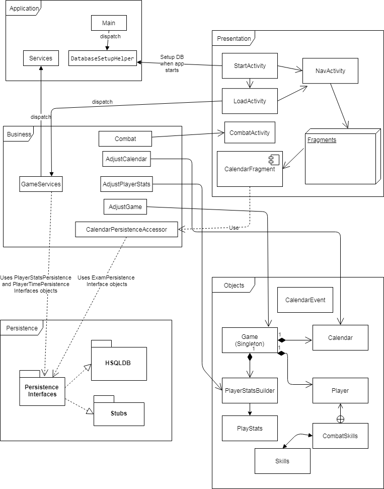

# _The C.S. Experience_ Architecture

The Computer Science Experience Game iteration 2 aims to expand upon our initial functionality to flesh out our game. The improvements include a store in which a player can purchase one-time use items, a job where you can earn money, and a database to load and save games.

As a group we have decided upon a simple object structure to facilitate our game. A set of objects work together to store the necessary information for our player to move through the game. In addition to our objects, we have implemented a seperate 'business' layer that encompasses all logic which might modify game state. As a result of this seperation, we have left nothing more than getters and setters in the object classes themselves, leaving all complex modification to our adjuster classes. In this way we can centralize all logic in the 'business' package, making adjustments to gameplay easier. Our database had tables to store our player stats, game timer, and calendar events. An access layer helps to centralize database interaction and supply data to persisitence and logic. Additional adjuster methods have been added to serve the jobs and store functionality, bloating our adjuster classes slightly, but maintaining the centralization of logic. 

## Structure Diagram

This diagram illustrates the flow of information and alterations from the UI down. Each UI element contains a game object and this object is used to instantiate an adjustGame object. Methods are called on user input and these methods go on to adjust the game objects themselves. This updated game state is then dispalyed back onto the UI.

## The _Objects_ Package
The purpose of the 'objects' package is to encompass all game objects that hold information as to the state of the game. A single top level 'Game' object is the primary resource for game access and modification. This top object contains a 'Player' object and a 'Calendar' object. The Calendar acts as both a time and day tracker to measure game state and progress but also works in tandem with a graphical Calendar to illustrate game progress and upcoming deadlines to the player. The 'Player' object holds simple information relevant to individual players. Their name, their choosen difficulty, and an instance of the 'PlayerStats' object allows for player information access from a high level. This 'PlayerStats' object contains all relevant information pertaining to a player's current state. A Player works through the game balancing their health (the happiness, energy, and hunger stats) with their academic stats (individual computer-science related skills). Because these objects are all contained either directly or indirectly in the 'Game' object, to access our game state is as simple as passing this 'Game' object and taking what information we need from it's instance variables.

## The _Business_ Package
To separate the logic of our application from the objects it applies to, we have mirrored the structure of our game objects with adjuster classes. The idea behind this is to have a single, top-level adjuster class called 'AdjustGame' That contains all methods necessary to tweak any game or player variable anywhere. To do this, our top-level adjusting class contains a copy of the game state along with instances of the sub-adjuster classes, 'AdjustStats' and 'AdjustCalendar'. By limiting outside game adjustment to methods in the top level, we can be sure that state adjustment happens in a top-down fashion, as often one player action might affect multiple fields located in several different objects. Some method redundency has been allowed from parent object to child instance to facilitate this centralization of adjusting methods to the top-level adjuster.

## Persistence 
As stated above, our database holds information pertaining to game events, and information to store player games. The game services class holds a 'save' and 'load' method. These act to save the current game state into memory, either as an update to an existing game, or a new entry. The load method takes the player name as the key, and returns that game to the current game state, if it exists in DB. A calendar accessor class has also been implemented in business to access and adjust our game events. To save a game, click the hamburger on the upper left corner of home screen and hit save. To load, do the same action and hit load, or initially navigate to the load screen and pick a named save. 

## Game Modification
The above implementation allows for a simple procedure in which to modify our game due to player actions. Our game state is stored in a singleton and accessed from wherever necessary. Once in a new activity or fragment, our game object is unpacked and whichever fields are necessary are retrived and displayed. To adjust the game state we simply instantiate an 'AdjustGame' variable using our given instance of the game object and modify at will through the methods and logic available. To save a game, we grab all player and time information from the current game variable and stashes it away in the db. In the same way the load function instantiates a new game variable, retrieves the stored info from db, and sets the new game variable to the retrieved data..

## The UI
A collection of UI elements consists of our player-facing implementation. An initial game screen with options to start a game or load a game and a start screen with field for player name makes the game introduction. Once a player has started or loaded a game they are directed to a home page. This page displays the player's health stats and the current day and period. A menu option in the upper left corner allows a player to navigate to a list of possible activities, a store, and a jobs selction screen along with a calendar showing upcoming exams. The activities page offers a player options as to how to spend their time. Each action has consequences for their health and academic skills. Upon selection of an activity the player is directed back to their home page and the change in time and health stats can be seen.
