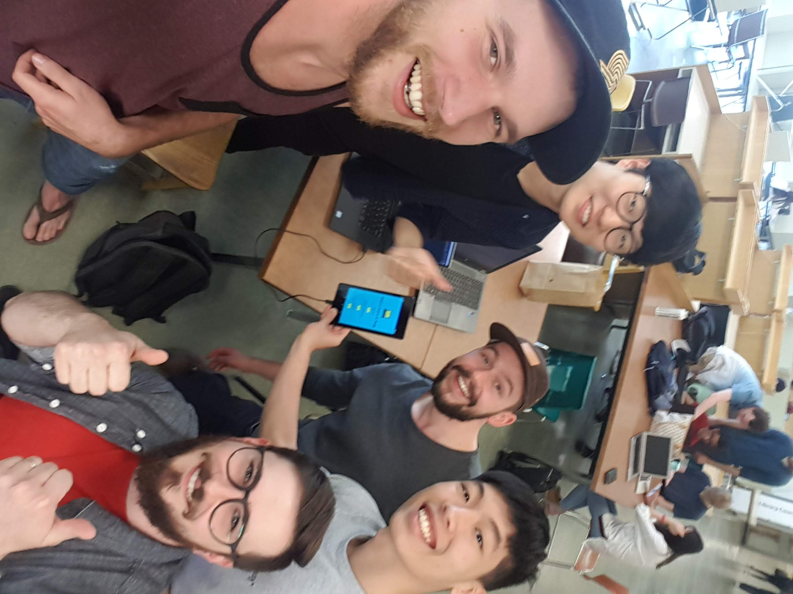

# README

## Our _Contributing_ Members

## A Note for the Marker Regarding Iteration 1:
Some user stories we had flagged for iteration 1 have been pushed back to iteration 2. These have been tagged with "Delayed-From-Iteration-1". Our initial overestimate of user story goals for iteration 1 is to be expected and we now have a more realistic idea of our abilities as a group. Most of these stories have to do with character evolution and combat skills. While implementing these features takes significant effort, it also requires game design and planning that is more appropriate for a later iteration.

[A link to our Architecture report:](/ARCHITECTURE.md)

## A Note for the Marker Regarding Iteration 0:
Please note that the issues section of this repo contains _all_ of the user stories for this project. The ones to be implementated in iteration 1 are labelled with the tag `Iteration-1`. All others are works in progress that will be revisited  following iteration 1.

## _The C.S. Experience_ Vision Statement

Spanning only 30 in-game days, _The C.S. Experience_ is a short, simulation-RPG hybrid videogame in which players assume the role of a computer science student and are fast-tracked through a single university term that demands them to manage their time, character health, studies and other factors in order to pass their exams. 

The weeks leading up to each exam period will present the player with a large degree of freedom and should be used to prepare for exams by engaging in character-developing activities. When it is time to write an exam, the player enters a turn-based style combat scenario, similar to _Pokemon_ or _Final Fantasy_. A well-prepared player, who's improved his or her *skills* by studying the course material, and has maintained his or her character's happiness, sleep, and hunger values will have an easier "combat encounter" with the exam, most likely receiving a higher grade.

Entertainment, through challenge and strategy, is _The C.S. Experience_'s greatest value. By providing players with challenging exams to combat and only a limited amount of time to execute an effective study regime from a bevy of activities/distractions, player's are given the tactical freedom to try out various strategies. An in-game calendar displaying exam dates aids the player in his or her planning as they can only perform two activities per day. Upon finishing the term, a summary of the player's choices and successes will be presented to them along with a score metric to provide a statisfying payoff: his or her GPA.

Themeatically, _The C.S. Experience_'s target audience will be Computer Science students/graduates. However, due to its gameplay, it will also strongly appeal to RPG fans, and possibly to the broader mobile games market. In terms of general demographics, the game is expected to appeal to players ages 18 - 50. As such, many features have been included to enhance the game's appeal and accessibility. For instance, _The C.S. Experience_ will be an entirely menu-based game. This design choice grants several benefits, such as simplicity and the ability to play with only one hand, making the game more accessible. Minor character customization will be included, allowing the player to enter a name for his or her character and select an avatar from a variety of genders and nationalities. Additionally, difficulty options, which determine the number of courses the player character is enrolled in, will be available, making the game fun for RPG veterans and novices alike. The game's _day-by-day_ style gameplay, coupled with a "save" feature, enables bite-sized play sessions ideal for on-the-go gaming. For instance, a player can play through a couple of quick days, save his or her progress to be continued later; or, they can play the game in long sessions, working towards long term goals (i.e. the exams). 

As a student project, the success of _The C.S. Experience_ will not be determined by how much profit it makes (it will not be sold) or by critical reception (we doubt anyone will take the time to review it). Instead, considering our team's inexperience designing and developing video games, the project will be considered a minor success if the game is playable from start to finish and contains _working_ implementations of game-critical features (e.g. art and music assets are not critical but menus are). If it is also feature complete with few to no bugs, it will be a general success. And, lastly, if it hits the previous criteria and atleast one player (aside from us) completes it and finds it fun, it will be considered a major success. 
